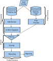
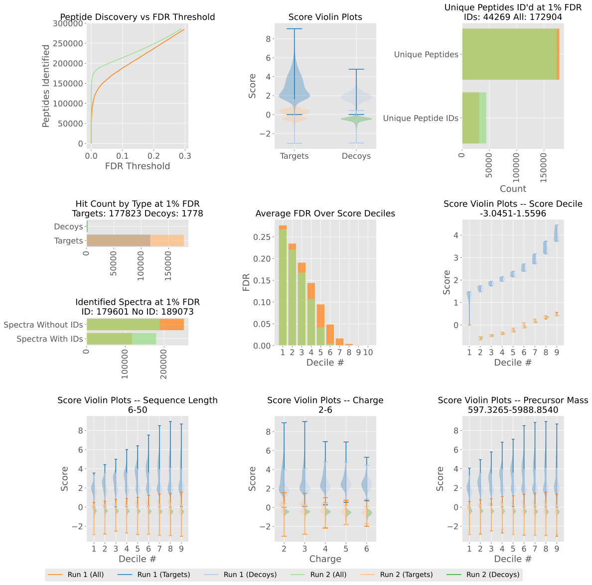

# Pepid: Research-Oriented, Highly Configurable Peptide Search Engine

## Quickstart

An example config is provided in data/default.cfg: it should be copied somewhere and modified to suit user preferences (keys not filled in the user file are taken from the default config).

```
python pepid.py <config.cfg>
```

Will run pepid. There are no command line arguments, all configuration is done through the configuration script. This makes tracking experimental details much easier.

Pepid also provides two utility scripts: `pepid_files.py <config.cfg> filetype` will output the paths to files matching a certain pepid artifact type (`report` will give the path to all normal report artifacts). `pepid_compare.py <config.cfg> <analysis1.pkl> <analysis2.pkl>` will plot two analyses on the same graph for easier comparative analysis. It can be used to compare results before/after rescoring, or to compare between two scoring methods, etc.

IMPORTANT: Pepid relies on numpy for some operations, which in turn relies on a platform BLAS implementation for efficiency. This may result, if running pepid in parallel, in exhausting resource limits (e.g. RLIMIT\_NPROC on linux).

This can be avoided by setting the right environment variables, at the likely cost of performance (for example: OMP\_NUM\_THREADS=1), or by reducing the amount of processes running in parallel.

## Why Pepid?

Pepid is a search engine that aims to decrease friction for research on peptide identification, especially for deep-learning-driven research. Unlike other engines, pepid operates in batches stages instead of end-to-end. In addition, pepid records every PSM that isn't given a score value of 0 (it is up to the score function, which is user-definable, to remap scores to 0 when they should be dropped, for example when they are "invalid"). This means that pepid has higher overhead (as it has to go over the collection of spectra, peptides and PSMs several times to complete, and also because it is limited by the speed of the disk), but it compensates by being able to stop processing in-between stages at any time and restart only from this stage. This serves two purposes:

- It is possible to process the spectra and peptide candidates only once, then quickly iterate on a new score function without having to redo this process;
- It is possible to stop processing at one stage, perform additional, perhaps manual, processing outside of pepid's control, and continue with further pepid phases.

These capabilities also greatly increase pepid's power and flexibility. For example, while pepid opeterates in parallel to use your CPU and RAM to the best of its ability, it does not currently explicitly support distributed computing. However, the phase-based nature of pepid means it is fairly simple to do the peptide candidate generation once, and then move the generated candidates and a subsampled mgf file on each compute node to run pepid independently for the search step. Then, the search results can all be combined with a simple copy-paste on a 'master' machine that can perform post-search rescoring and analysis.



## Cutomizable

Pepid makes as many parts of its process modifiable by the user, not just in terms of parameters (such as the batch size and thread count for a part of the process), but also at the function level: pepid allows arbitrary callables to be specified instead of most of its default functions, enabling a stronger version of x!tandem's pluggable score system.

Unlike previous search engines, pepid doesn't limit function customizable to a few parts such as scoring, but rather exposes everything from scoring and rescoring to peptide candidate generation and spectrum processing.

## Fast

While pepid has some overhead compared to other engines due to its organization, it makes effective use of vectorization and JIT compilation via numba where it counts. Pepid also implements optimizations, such as a simple linear-time version of the hyperscore algorithm, which makes it faster than x!tandem with similar parameters despite being written in python.

## Scoring Functions

Pepid supports baseline scoring functions based on the popular search engines Comet and X!Tandem with improvements that let it identify significantly more peptides at low FDR in realistic scenarios.

Pepid currently implements two basic scoring functions, plus the combination of the two. Namely, pepid implements the Xcorr function based on the Comet codebase as of Dec 14, 2022 as well as the Hyperscore function from the X!Tandem codebase as of the same date.

Pepid differs from those algorithms in a few ways: firstly, many of the parameters that are hardcoded into these search engines are exposed as parameters in pepid (for example, the factor by which to multiply the peak intensity after normalization in both cases, or the norm to use for the normalization step, or the amount of windows to use for normalization in the xcorr algorithm).

Secondly, pepid expand upons both the xcorr and hyperscore functions in various ways. Among others, pepid implements 3 ppm-based variants of the bin resolution in xcorr, which we find increase identification rates. Pepid also optionally assumes a different hyperscore model where the sum of intensity is assumed to come equivalently from each of the top N (for a user-definable N) peak matches, rather than the default x!tandem assumption of collective provenance.

On the other hand, pepid does not implement the E-score from Comet. Likewise, pepid does not implement the linear fit-based threshold component of X!Tandem (the function `expect_protein` that interacts with the parameter `refine, maximum valid expectation value`). This is because E-score and `expect_protein` defeat TDA-FDR assumptions by modifying the score distribution based on other values than the curent peptide and spectrum.

## Standard Tooling

Pepid reads mgf files for input spectra and protein fasta files for the protein database. For rescoring, pepid supports Percolator as well as a custom random forest rescorer.

## Analysis

As mentioned previously, pepid stores all PSM data in its database artifacts. It also outputs a sample of that data for easier examination, as well as providing standard TDA-FDR analysis.

Pepid also outputs a graphical report that can be used to quickly ascertain the quality of the search results, and helps identify potential sources of bias (such as the well-known peptide length bias in the Xcorr and Hyperscore functions). In addition, pepid offers a utility called `pepid_compare.py` which can be used to plot two different analyses on the same graph for comparison. The output of `pepid_compare.py` to examine rescoring by Percolator is shown below.



## WIP

Pepid is currently work in progress. Missing elements include a full port and proper integration of deep learning-driven components (spectrum property extraction, theoretical spectrum generation, and more), and an alternative to TDA-FDR evaluation.

See upcoming paper for more details.
